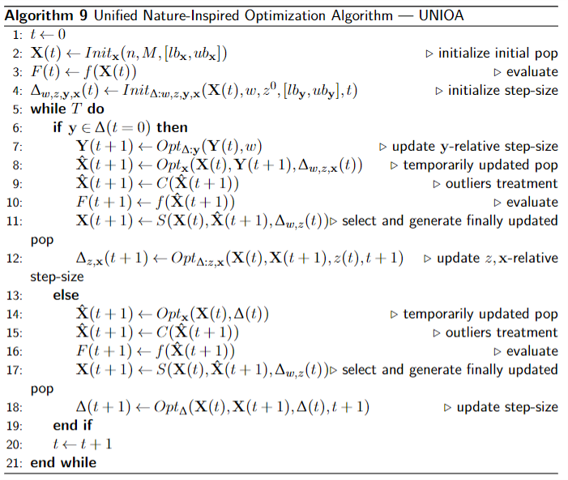

# UNIOA
- [ Description. ](#desc)
- [ Ideas. ](#idea)
- [ Environment. ](#env)
- [ Example. ](#exm)
- [ Versions. ](#ver)

<a name="desc"></a>
## Description
UNIOA can help:
1. design your own swarm-based algorithms with only math knowledge, without any nature/bio knowledge.
2. benchmark your optimization algorithm **Your_Opt** with other seven existing algorithms with the help of IOHprofiler.

UNIOA is a small python package in which the user can design his/her own algorithm like nature-inspired algorithms. This package is inspired by standardizing nature-inspired algorithms project in which we build up a generic framework based on studying seven popular swarm-based algorithm.
<a name="idea"></a>
## Ideas
We built up this generic framework that can cover seven algorithms now. The generic framework is :

- **line1** iteration counter. At this moment, the optimization starts.
- **line2** initialize the initial pop with size M. Compulsory part. Fixed in UNIOA.
- **line3** evaluate fitness. Compulsory part. Fixed in UNIOA with the help of IOH.
- **line4** initialize influencing factors. Elective part. Open in UNIOA. **Customized part by users or select from UNIOA**.
- **line5** stop condition. Compulsory part. Fixed in UNIOA with the help of IOH.
- **line6** update assisting vector influencing factor. Elective part. Open in UNIOA. **Customized part by users**.
- **line7** update pop. Compulsory part. Open in UNIOA. **Customized part by users**.
- **line8** evaluate fitness. Compulsory part. Fixed in UNIOA with the help of IOH.
- **line9** selection. Compulsory part. Fixed/Open in UNIOA. **Customized part by users or select from UNIOA**.
- **line10** iteration counter. At this moment, the pop already is updated one time.
- **line11** update other vector influencing factors or dynamic numerical influencing factors. Elective part. Open in UNIOA. **Customized part by users**.

<a name="env"></a>
## Environment
```python
Python = 3.7
ioh = 0.3.2.3
numpy = 1.18.2
numba = 0.54.1
sklearn = 1.0
```
<a name="exm"></a>
## Example
1. install relative packages
```python
pip install ioh == 0.3.2.3
pip install UNIOA
```
2. open a .py file. For example: example.py
3. only import UNIOA
````python
from UNIOA import *
````
4. design your optimizer in math. For example:
- I want to use follows to improve the quality of optimization.
    - assisting vector influencing factor $\mathbf{y}_i$.
    - $\mathbf{x}$ related vector influencing factor $\mathbf{x}_{i_p}$. 
    - dynamic numberical influencing factor $z$. 
    - static numberical influencing factors $w$.


<a name="ver"></a>
## Versions
`2021.12.31: only works in .py file now`